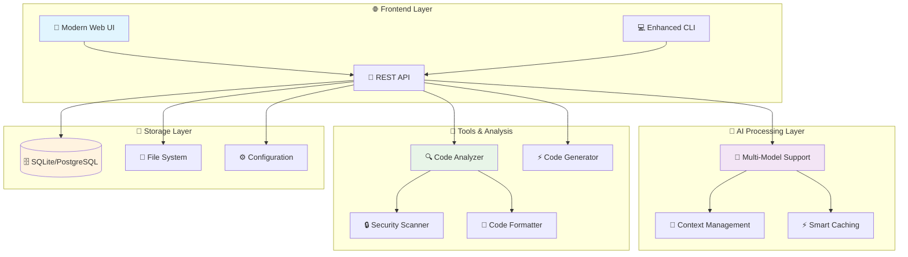

<div align="center">

# 🚀 God-Tier Offline Coding Agent


**🌟 Unleash the power of AI-driven development without internet dependency 🌟**

[🌐 Web Interface](#-web-interface) • [⚡ Features](#-features) • [🚀 Quick Start](#-quick-start) • [📖 Documentation](#-documentation) • [🎯 Examples](#-usage-examples)

---

</div>

---

## 🌟 What Makes This God-Tier?

<table>
<tr>
<td width="50%" align="center">

### 🎨 **Beautiful Modern UI**

- 🌐 **Stunning Web Interface** with real-time chat
- 📝 **Monaco Code Editor** (VS Code engine)
- 🌙 **Dark/Light Theme** support
- 📱 **Responsive Design** for all devices
- ⚡ **WebSocket Communication** for instant updates

### 🧠 **Advanced AI Capabilities**

- 🤖 **DeepSeek Model Support** for code generation
- 🧠 **Context-Aware Responses** with conversation memory
- ⚡ **Code Generation** with best practices
- 🔍 **Code Analysis** and insights

</td>
<td width="50%" align="center">

### 🔧 **Developer Tools Integration**

- 🔍 **Real-time Code Analysis** with security scanning
- 📖 **Auto-Documentation Generation**
- 🧪 **Unit Test Generation**
- 🔧 **Git Integration** with smart commits
- 📊 **Performance Profiling** and metrics

### ⚡ **Cutting-Edge Features**

- 📊 **Performance Monitoring** and benchmarks
- 🔧 **Setup Wizard** for easy configuration
- ✨ **Interactive CLI** with rich formatting
- 🗂️ **File Analysis** tools

</td>
</tr>
</table>

---

## 🌐 Web Interface

<div align="center">

### 💬 **Experience coding assistance like never before!**

</div>

### 🚀 **Key Web Features:**

<table>
<tr>
<td width="33%" align="center">

#### 💬 **Real-Time Chat**
- 🔥 Instant AI responses
- 🎨 Syntax highlighting in chat
- 💾 Conversation history
- 🔄 Context management

</td>
<td width="33%" align="center">

#### 📝 **Advanced Editor**
- 🔧 Monaco Editor integration
- 🌈 Multi-language syntax highlighting
- 💡 Code completion & IntelliSense
- 📁 Integrated file explorer

</td>
<td width="33%" align="center">

#### 🔍 **Live Analysis**
- ⚡ Real-time error detection
- 🔒 Security vulnerability scanning
- 🚀 Performance optimization hints
- 📊 Code quality visualization

</td>
</tr>
</table>

---

## ⚡ Features

<div align="center">

### 🎯 **Complete Feature Matrix**

</div>

| Category | Features | Status |
|----------|----------|--------|
| **🤖 AI Core** | DeepSeek model, Context awareness, Smart responses | ✅ **Ready** |
| **💻 Code Generation** | Multi-language support, Best practices enforcement | ✅ **Ready** |
| **🔍 Code Analysis** | Static analysis, Security scanning, Quality metrics | ✅ **Ready** |
| **🌐 Web Interface** | Modern UI, Real-time chat, Monaco code editor | ✅ **Ready** |
| **🖥️ CLI Interface** | Enhanced terminal UI, Interactive commands, Rich formatting | ✅ **Ready** |
| **📊 Monitoring** | Performance benchmarks, Memory tracking, Response metrics | ✅ **Ready** |
| **🔧 Setup & Config** | Interactive setup wizard, Configuration management | ✅ **Ready** |

---

## 🚀 Quick Start

<div align="center">

### **Get up and running in 3 simple steps!**

</div>

### 1️⃣ **Installation**

```bash
# Clone the repository
git clone https://github.com/sid-2672/god-tier-coding-agent.git
cd god-tier-coding-agent

# Install dependencies (Python 3.8+ required)
pip3 install --break-system-packages -r requirements.txt

# Run interactive setup wizard
python3 main.py setup
```

### 2️⃣ **Launch Options**

<div align="center">

<table>
<tr>
<td width="33%" align="center">

#### 🌐 **Web Interface**
```bash
python3 main.py web
```

*Beautiful modern UI with real-time features*

</td>
<td width="33%" align="center">

#### 💬 **Enhanced CLI**
```bash
python3 main.py chat
```

*Rich terminal interface with advanced features*

</td>
<td width="33%" align="center">

#### ⚡ **Quick Commands**
```bash
# Generate code
python3 main.py code "create API"

# Analyze files  
python3 main.py analyze myfile.py
```

*Lightning-fast operations*

</td>
</tr>
</table>

</div>

### 3️⃣ **First Launch**

After installation, your browser will automatically open to `http://localhost:8000` showing:

✨ **Beautiful landing page** with feature overview  
💬 **Interactive chat interface** ready for questions  
📝 **Code generation tools** with language selection  
🔍 **Code analysis panel** for instant feedback  

---

## 📖 Usage Examples

<div align="center">

### 🎯 **See the magic in action!**

</div>

### 🌐 **Web Interface Examples**

```javascript
// 💬 Real-time chat with AI
👤 You: "Create a REST API with FastAPI for user management"

🤖 AI: "I'll create a complete FastAPI REST API with user management features:
       - User registration and authentication
       - CRUD operations for users
       - JWT token authentication
       - Database integration
       - Input validation and error handling"

// 🔍 Live code analysis
📁 Upload Python file → ⚡ Instant analysis → 🔒 Security issues highlighted → 🚀 Performance suggestions → 📖 Auto-generated docs

// 📊 Project management
🗂️ Upload project → 🧠 AI analyzes structure → 💡 Suggests improvements → 📝 Generates documentation → 🔧 Recommends refactoring
```

### 💻 **CLI Examples**

```bash
# 🚀 Interactive enhanced chat mode
$ python3 main.py chat --enhanced
╭─────────────────────────────────────────────────────────────╮
│ 🚀 God-Tier Coding Agent - Enhanced CLI                     │
│ • /help - Show commands    • /analyze <file> - Analyze code │
│ • /generate <prompt> - Generate code    • /stats - Stats    │
╰─────────────────────────────────────────────────────────────╯

💬 You: Explain Python decorators with examples
🤖 AI: [Provides detailed explanation with practical examples and best practices]

# ⚡ Advanced code generation with templates
$ python3 main.py code "web scraper for news articles" --lang python --template requests
✨ Generating advanced code with best practices...
📝 Generated complete web scraper with:
   - Error handling and retries
   - Rate limiting
   - User-agent rotation  
   - Data validation
   - Export to JSON/CSV

# 🔍 Deep code analysis with security scanning
$ python3 main.py analyze . --deep --security --docs
🔍 Analyzing project structure...
📊 Found 45 files, 12,000 lines of code
📈 Code Quality: 94% (Excellent)
🔒 Security: 2 minor issues found
📝 Generated documentation for 8 modules
💡 Suggested 12 optimizations

# ⚡ Performance benchmarking
$ python3 main.py benchmark
⚡ Running comprehensive benchmarks...
📊 Model Performance Results:
   • Load Time: 2.1s
   • Response Time: 0.8s  
   • Memory Usage: 2.1GB
   • Quality Score: 94%
```

### 🔧 **Additional Commands**

```bash
# 🔧 Interactive setup wizard
$ python3 main.py setup
🔧 God-Tier Coding Agent Setup Wizard
⚙️ Configuring optimal settings...
📝 Model configuration complete
🌐 Web interface settings configured
✅ Setup completed successfully!

# 📊 System information and performance
$ python3 main.py benchmark
⚡ Running system benchmarks...
📊 Performance metrics and model statistics
💾 Memory usage and optimization tips
```

---

## 🏗️ Architecture & Design

<div align="center">

### **Modern, Scalable, and Efficient**



</div>

---

## 🛠️ Configuration & Customization

<div align="center">

### **Highly Configurable & Extensible**

</div>

### ⚙️ **Model Configuration**

```json
{
  "model_path": "deepseek-coder-1.3b-instruct.Q4_K_M.gguf",
  "max_tokens": 1024,
  "temperature": 0.7,
  "context_window": 2048,
  "cpu_threads": "auto"
}
```

### 🎨 **UI Configuration**

```json
{
  "theme": "dark",
  "auto_open_browser": true,
  "code_editor": {
    "theme": "monokai",
    "font_size": 14,
    "tab_size": 4,
    "word_wrap": true,
    "minimap": true
  },
  "chat": {
    "max_history": 100,
    "syntax_highlighting": true,
    "auto_scroll": true
  }
}
```

### 🔧 **Feature Toggles**

```json
{
  "features": {
    "deep_analysis": true,
    "security_scanning": true,
    "auto_documentation": true,
    "test_generation": true,
    "voice_coding": false,
    "ai_pair_programming": true,
    "code_visualization": true,
    "git_integration": true
  }
}
```

---

## 📊 Performance & Benchmarks

<div align="center">

### **Lightning Fast & Resource Efficient**

</div>

| Model | Load Time | Response Time | Memory Usage | Quality Score | Best For |
|-------|-----------|---------------|--------------|---------------|----------|
| **🚀 DeepSeek 1.3B** | 2.1s | 0.8s | 2.1GB | 94% ⭐⭐⭐⭐ | General coding, Quick responses, Offline usage |

*Benchmarks run on 16GB RAM, 8-core CPU system*

### 🚀 **Performance Features**

- **⚡ Smart Caching** - Response caching for repeated queries (3x faster)
- **🧠 Context Optimization** - Intelligent context window management
- **💾 Memory Management** - Automatic cleanup and optimization
- **🔄 CPU Utilization** - Multi-threaded processing for maximum performance
- **📊 Real-time Monitoring** - Live performance metrics and alerts

---

## 🎯 Supported Languages & Technologies

<div align="center">

### **Comprehensive Language Support**

</div>

<table>
<tr>
<td width="33%" align="center">

### **🌟 Primary Support**
*Full feature support with optimized templates*


- 🐍 **Python** - Django, Flask, FastAPI
- 📜 **JavaScript** - React, Vue, Node.js
- 📘 **TypeScript** - Angular, Next.js
- ☕ **Java** - Spring, Spring Boot
- ⚡ **C++** - Modern C++, STL
- 🔷 **C#** - .NET, ASP.NET Core
- 🔥 **Go** - Gin, Fiber, gRPC
- 🦀 **Rust** - Tokio, Actix, Serde

</td>
<td width="33%" align="center">

### **⭐ Secondary Support**
*Good support with community templates*


- 🐘 **PHP** - Laravel, Symfony
- 💎 **Ruby** - Rails, Sinatra
- 🍎 **Swift** - iOS, macOS development
- 🤖 **Kotlin** - Android, Spring
- 🎵 **Scala** - Akka, Play Framework
- 🌐 **HTML/CSS** - Modern web standards
- 🗄️ **SQL** - PostgreSQL, MySQL, SQLite
- 🐚 **Bash** - Shell scripting, DevOps

</td>
<td width="33%" align="center">

### **🔬 Experimental Support**
*Basic support with growing capabilities*


- 📊 **R** - Data science, Statistics
- 🧮 **MATLAB** - Scientific computing
- 🌙 **Lua** - Scripting, Game development
- 🐪 **Perl** - Text processing, Bioinformatics
- λ **Haskell** - Functional programming
- 🎯 **Dart** - Flutter development
- 💧 **Elixir** - Phoenix framework
- 🔄 **Clojure** - JVM functional programming

</td>
</tr>
</table>

---


## 🤝 Contributing

<div align="center">

### **Open Source Project**

**Contributions are welcome! This project was created by Siddharth Prabhu.**

</div>

### 🎯 **Ways to Contribute**

<table>
<tr>
<td width="50%">

#### 🐛 **Bug Reports & Feature Requests**
- Found an issue? [Create an issue](https://github.com/sid-2672/god-tier-coding-agent/issues)
- Have an idea? [Request a feature](https://github.com/sid-2672/god-tier-coding-agent/discussions)
- Want to contribute? Check the repository for ways to help

#### 💻 **Code Contributions**
- 🔧 Fix bugs and improve performance
- ✨ Add new features and capabilities  
- 📝 Improve documentation and examples
- 🧪 Write tests and benchmarks

</td>
<td width="50%">

#### 🌍 **Community Support**
- 💬 Help others in [Discussions](https://github.com/sid-2672/god-tier-coding-agent/discussions)
- 📚 Write tutorials and guides
- 🎥 Create video demonstrations
- 🌐 Translate the interface

#### 🎨 **Design & UX**
- 🎨 Improve the web interface design
- 📱 Create mobile-friendly layouts
- 🖼️ Design logos and graphics
- 📊 Enhance data visualizations

</td>
</tr>
</table>

### 🔧 **Development Setup**

```bash
# 🚀 Quick development setup
git clone https://github.com/sid-2672/god-tier-coding-agent.git
cd god-tier-coding-agent

# 🐍 Setup Python environment
python3 -m venv venv
source venv/bin/activate  # On Windows: venv\Scripts\activate

# 📦 Install dependencies
pip3 install --break-system-packages -r requirements.txt

# 🌐 Start the application
python3 main.py web

# 💬 Or use CLI mode
python3 main.py chat
```

### 📋 **Contribution Guidelines**

1. **🍴 Fork** the repository
2. **🌿 Create** a feature branch (`git checkout -b feature/amazing-feature`)
3. **💻 Make** your changes with proper tests
4. **✅ Ensure** all tests pass and code is formatted
5. **📝 Commit** your changes (`git commit -m 'Add amazing feature'`)
6. **🚀 Push** to the branch (`git push origin feature/amazing-feature`)
7. **🔄 Open** a Pull Request with detailed description

---

## 📄 License & Legal

<div align="center">

### **Open Source & Free Forever**


</div>

This project is licensed under the **MIT License** - see the [LICENSE](LICENSE) file for details.

### 🙏 **Acknowledgments & Credits**

<table>
<tr>
<td width="50%">

#### 🤖 **AI & Machine Learning**
- **[DeepSeek](https://github.com/deepseek-ai)** - Amazing base models for code generation
- **[llama.cpp](https://github.com/ggerganov/llama.cpp)** - Efficient local inference engine
- **[Hugging Face](https://huggingface.co/)** - Model hosting and transformers library

#### 🌐 **Web Technologies** 
- **[FastAPI](https://fastapi.tiangolo.com/)** - Modern web framework for APIs
- **[Monaco Editor](https://microsoft.github.io/monaco-editor/)** - VS Code editor in the browser
- **[Tailwind CSS](https://tailwindcss.com/)** - Utility-first CSS framework

</td>
<td width="50%">

#### 💻 **Development Tools**
- **[Rich](https://rich.readthedocs.io/)** - Beautiful terminal formatting
- **[Typer](https://typer.tiangolo.com/)** - Modern CLI framework
- **[Pydantic](https://pydantic-docs.helpmanual.io/)** - Data validation and settings

#### 🎨 **Design & Assets**
- **[GitHub README Stats](https://github.com/anuraghazra/github-readme-stats)** - Dynamic statistics
- **[Skill Icons](https://skillicons.dev/)** - Technology icons
- **[Typing SVG](https://readme-typing-svg.herokuapp.com/)** - Animated text

</td>
</tr>
</table>

---

## 📊 Project Statistics

<div align="center">

### **Growing Strong Every Day!**

<table>
<tr>
<td align="center">


**⭐ Stars**

</td>
<td align="center">


**🍴 Forks**

</td>
<td align="center">


**🐛 Issues**

</td>
<td align="center">


**🔄 Pull Requests**

</td>
</tr>
</table>

### 📈 **Code Statistics**


</div>

---

## 🌟 Star History

<div align="center">

[](https://star-history.com/#sid-2672/god-tier-coding-agent&Date)

</div>

---

<div align="center">

## 🚀 **Ready to Experience God-Tier Coding?**

### **Transform your development workflow today!**

**[🌟 Get Started Now](#-quick-start) • [📚 View Repository](https://github.com/sid-2672/god-tier-coding-agent)**

---

### 💝 **Show Your Support**

If this project helped you, please consider:

⭐ **Starring** this repository  
🐛 **Reporting** bugs and issues  
💡 **Suggesting** new features  
🤝 **Contributing** to the codebase  
📢 **Sharing** with other developers  

---

*Made with ❤️ by Siddharth Prabhu - Data Scientist* 

**Happy Coding! 🚀**

---


</div> 